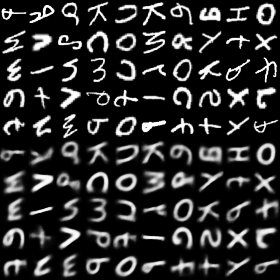
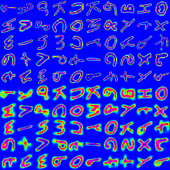

# CapsNet-Pytorch-EMNIST-letters

A Pytorch implementation of CapsNet in the paper:   
[Sara Sabour, Nicholas Frosst, Geoffrey E Hinton. Dynamic Routing Between Capsules. NIPS 2017](https://arxiv.org/abs/1710.09829)   

Thanks for https://github.com/XifengGuo/CapsNet-Pytorch
 
**TODO**
- Conduct experiments on other datasets. 
- Explore interesting characteristics of CapsuleNet.
- Test the reconstruction results on the EMNIST-letters

## Usage: Same as the https://github.com/XifengGuo/CapsNet-Pytorch

**Step 1.
Install [Pytorch](https://github.com/pytorch/pytorch) from source**

I'm using the source code of Nov 24, 2017. The newest code should be working too.   
Go https://github.com/pytorch/pytorch for installation instructions.

**Step 2. Clone this repository to local.**
```
git clone https://github.com/XifengGuo/CapsNet-Pytorch.git
cd CapsNet-Pytorch
```

**Step 3. Train a CapsNet on MNIST**  

Training with default settings:
```
python capsulenet.py
```

Launching the following command for detailed usage:
```
python capsulenet.py -h
``` 

**Step 4. Test a pre-trained CapsNet model**

Suppose you have trained a model using the above command, then the trained model will be
saved to `result/trained_model.pkl`. Now just launch the following command to get test results.
```
python capsulenet.py --testing --weights result/trained_model.pkl
```
It will output the testing accuracy and show the reconstructed images.
The testing data is same as the validation data. It will be easy to test on new data, 
just change the code as you want.

You can also just *download a model I trained* from 
https://pan.baidu.com/s/1dFLFtT3


## Results       

**Reconstruction result**  

Digits at top 5 rows are real images from EMNIST and 
digits at bottom are corresponding reconstructed images.

All the results are based on 5 epochs traing.
Time for training is 480s/epoch on  GTX1060

Results can showing by both one-channel and color


